# Digital Dude

[](https://shields.io/)

## Table of Contents:
* [Description](##Description)
* [Getting Started Remotely](##Installation-&-Getting-Started-Remotely)
* [Getting Started Locally](##Installation-&-Getting-Started-Locally)
* [Technologies Used](##Technologies-Used)
* [Usage](##Usage)
* [Contributors](##Contributors)
* [Special Thanks](##Special-Thanks)
* [Deployed](##Deployed)

## Description
A retro full-stack clone of the original Tamagotchi game from the 80's. Create an account, add some pets & keep them alive as long as you can.

<p align="center">
   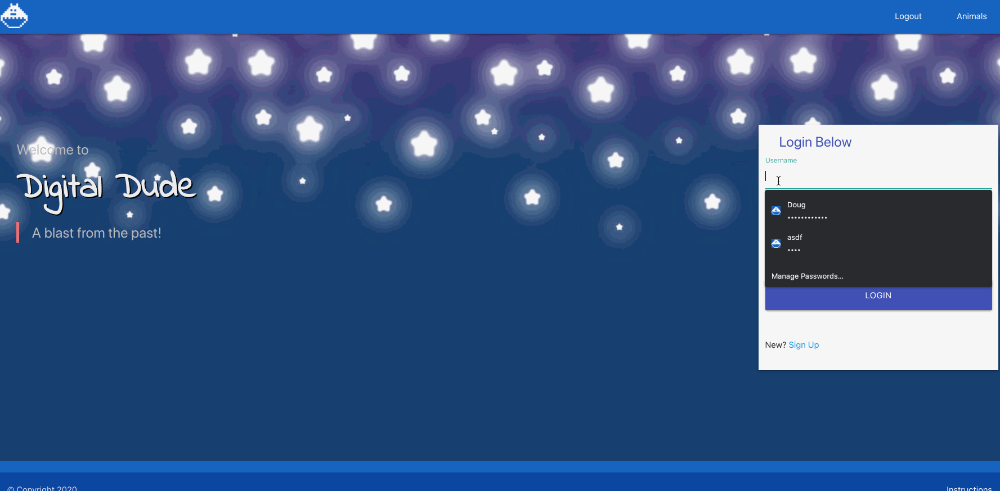
   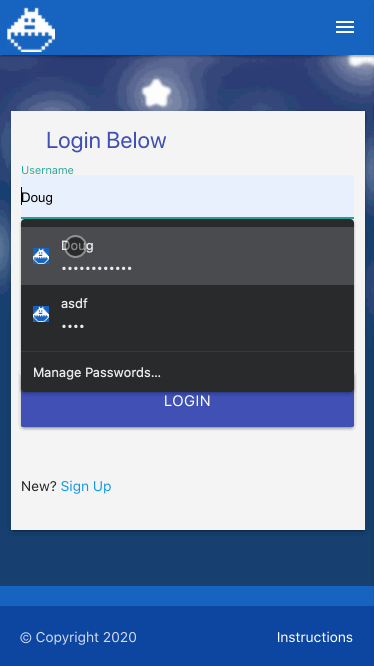
</p>

## Installation & Getting Started Remotely
* [hosted site](http://www.digital-dude.com)
* [repo](https://github.com/megan-pg/tamagotchi)

## Installation & Getting Started Locally

1. Clone from the [Repo](https://github.com/megan-pg/tamagotchi.git): 
  ```
  git clone https://github.com/megan-pg/tamagotchi.git
  ```
2. Install dependencies:
  ```
  npm install
  ```
3. Create .env file at root directory, change values as needed (for use with MySQL database):
  ```
  DB_PASSWORD='password'
  DB_HOST='localhost'
  DB_USER='root'
  DB_NAME='tamagotchi_db'
  DB_PORT='3306'
  ACCESS_TOKEN_SECRET={{a really long 64 bit string}}
  REFRESH_TOKEN_SECRET={{an equally really long but distinct 64 bit string}}
  ```
4. Create & run MySQL Database:
  * Install: 
    * [MySQL Install (Mac)](https://dev.mysql.com/doc/mysql-osx-excerpt/5.7/en/osx-installation-pkg.html)
    * [MySQL Workbench](https://www.mysql.com/products/workbench/)
  * Run MySQL, from System Prefrences.
  * Open MySQL Workbench, not required but helps to see what's going on in the DB

5. Run application:
  ```
  node server.js
  ```

6. Open [localhost](http://localhost:8080/)
7. [Play](##Usage)

## Technologies Used
Project is created with:
* HTML5
* CSS3
* Materialize
* Pixelart.com
* Texture Packer (to create sprite sheets)
* Javascript
* MySql
* Heroku
* Node.js
    * bcryptjs
    * dotenv
    * express
    * jsonwebtoken
    * mysql2
    * sequelize
    * uuid

## Usage

### Create Your Pet
<p align="center">
   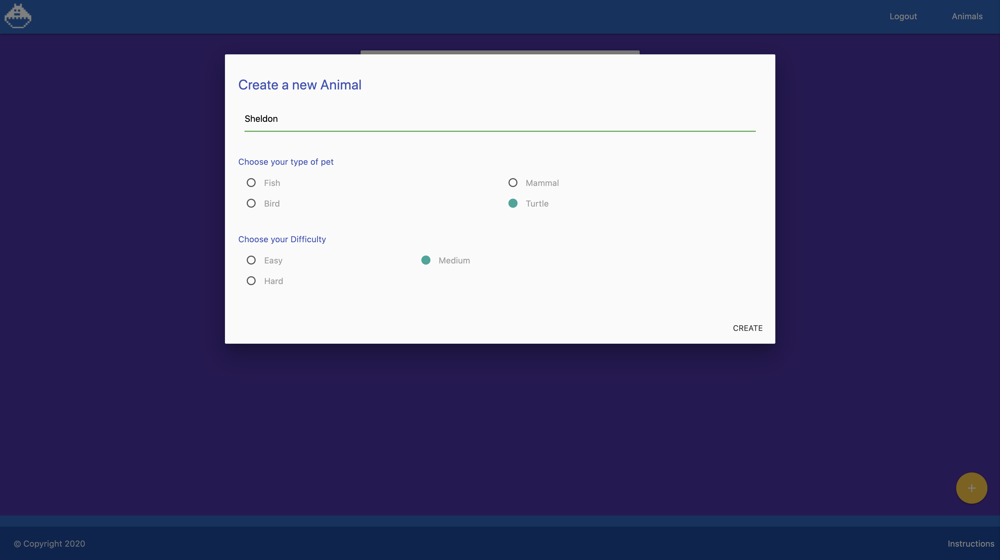
</p>

* Give it a name
* Choose the species:
    * Turtle
    * Fish
    * Bird
    * Mammal
* Choose level of difficulty:
    * Easy - Starts off with meters near empty
    * Medium - Starts off with meters half full
    * Hard - Starts off with meters almost full

### Take Care of Your Pets
<p align="center">
   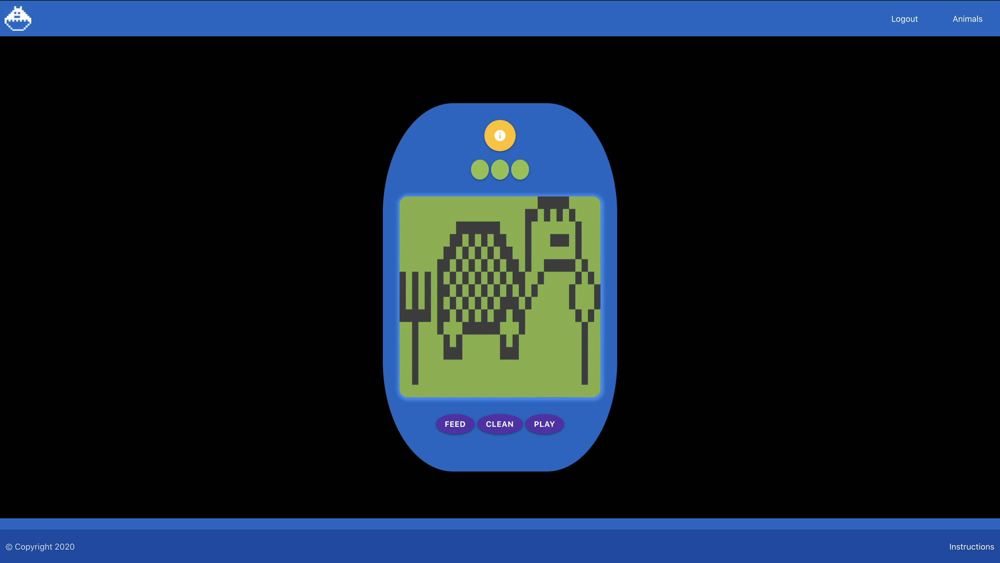
</p>

Be sure to take note of how your pet is behaving before giving interacting with it. Even usually helpful interactions can be harmful or neglectful if other attributes are more in need of your attention.

* Feed - Keep your pet well fed, otherwise they'll get hungry ortired.
* Clean - Keep your pet's surroundings clean, otherwise they'll get dirty or sick.
* Play - Keep your pet entertained, otherwise they'll get bored.
* Sleep - Give your pet some rest.
* Medicine - Give your pet some medicine.
* Love - Give you pet some love.

### Check on Your Pets' Status
<p align="center">
   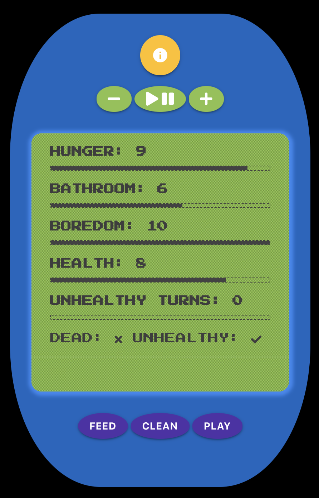
   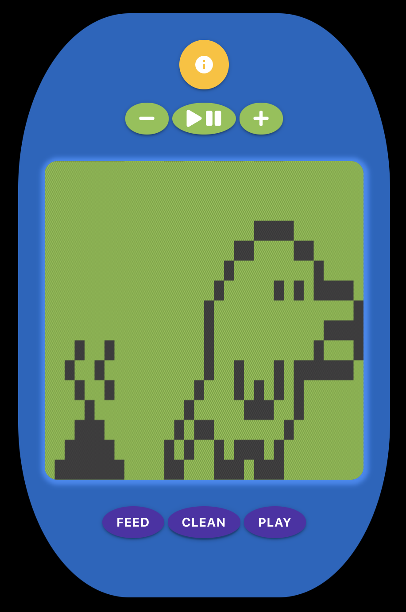
   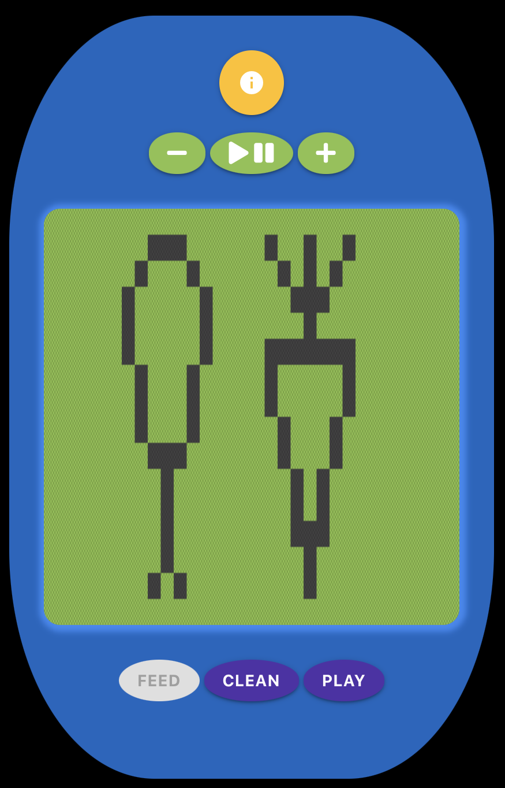
   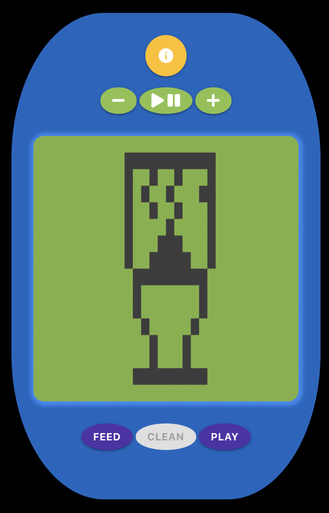
   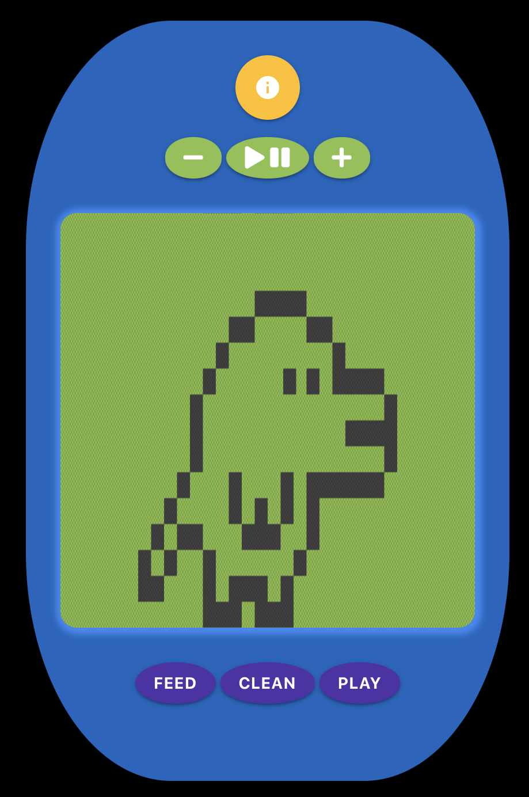
</p>

* Open the menu to check on status of your pet:
    * Hunger / Fatigue
    * Bathroom / Cleanliness
    * Boredom / Love
    * Overall Health
    * Length of Unhealthiness

### Play Some Music
* Play/Pause
* Volume Up
* Volume Down

### Lay to Rest
<p align="center">
   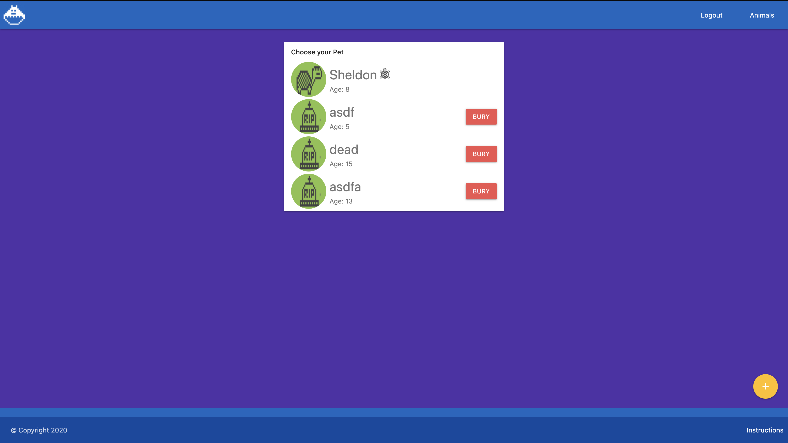
</p>

* Bury - If your pet has grown ill and passed away, you may bury them from the pets list.

## Contributors
<p align="center">
  <a href="https://github.com/megan-pg">
  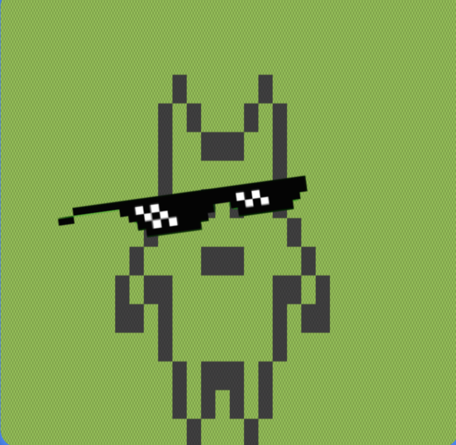
  </a> 

  <a href="https://github.com/Spazcool">
  
  </a> 

  <a href="https://github.com/sehouse">
  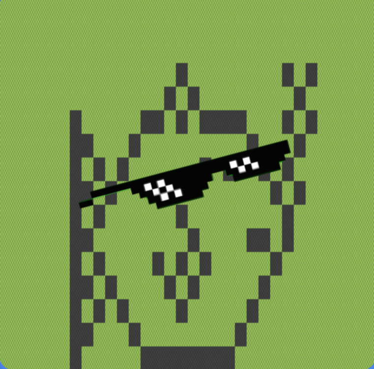
  </a>

  <a href="https://github.com/kmcleod81">
  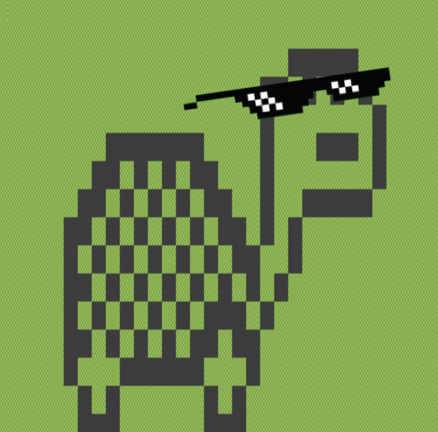
  </a>
</p>

## Special Thanks/Credits
* Game Music: "Chubby Cat", from PlayOnLoop.com Licensed under Creative Commons by Attriution 4.0
* Additional sound effects from [Zap Splat](https://www.zapsplat.com)
* Cool bouncy animation found on codepen @champa720

## Depolyed
* [Digital Dude](http://www.digital-dude.com)
